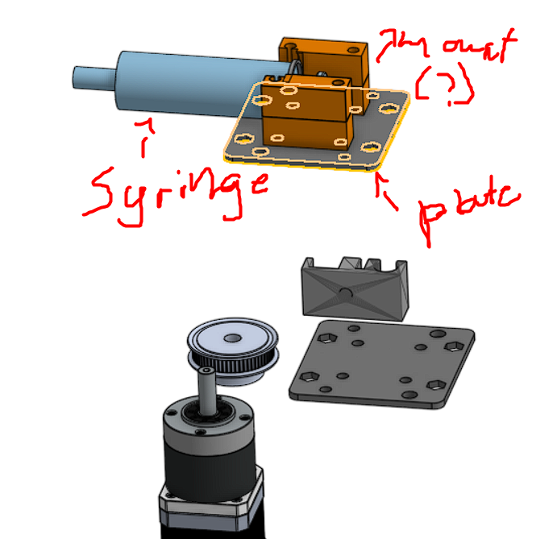

# Journal, the place where we store all progress

## The idea
Choco3DP is a 3d printer that allowes you to print with chocolate, pretty simple, right? Well we had a lot of problems, and a lot of success in the same way.

## Day 1:
We formulated the idea, and decided on a movement system and planned everything out with a very detailed sketch that Evan drew. We started on the CAD (computer aided design) for the project, we decided to use OnShape for this purely because of its nice collaborative features. This project started off with a syringe, a bunch of aluminum extrusions, and high hopes. CAD pictures are included. We also decided on how we are going to invest our time so we have a half working (?) demo by the end of this hackathon. 